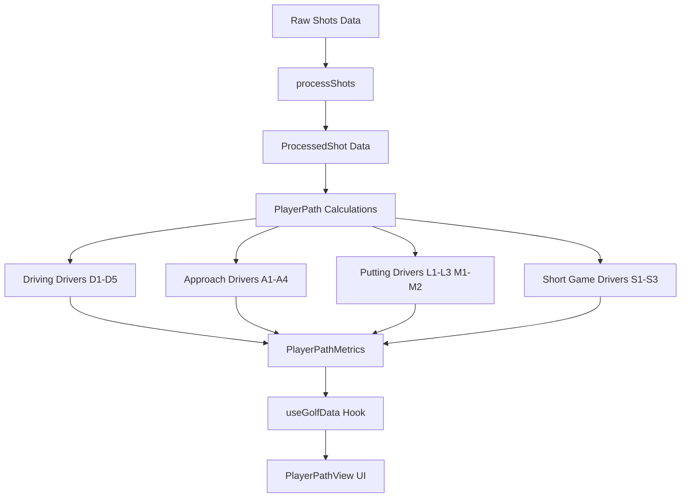

# PlayerPath Tab Redesign Plan

## Overview
Completely redesign the PlayerPath tab to identify Performance Drivers using a structured framework that measures specific, measurable aspects of a player's game with statistically significant and repeatable impact on strokes gained outcomes.

## Performance Driver Categories

### 1. Driving (D1-D5)
- **D1 — Tee Shot Penalty Rate**: Flag when tee shot penalties (startLie='Tee' AND penalty=true) exceed 5% (moderate) or 10% (severe)
- **D2 — Distance Deficiency**: Flag when >50% of fairway tee shots produce negative SG
- **D3 — Severe Misses**: Flag when tee shots ending in 'Recovery' exceed 5% of total tee shots
- **D4 — Rough Penalty on Long Second Shots**: Flag when FW hit rate <50% AND avg second shot distance from rough >150y. Moderate at 150-175y, high above 175y
- **D5 — Driver Value Gap**: Compare SG on tee shots when hitting driver vs non-driver

### 2. Approach (A1-A4)
- **A1 — GIR Rate by Distance Band**:
  - 50-100y: <90% flag
  - 100-150y: <80% flag
  - 150-200y: <70% flag
  - 200y+: <50% flag

- **A2 — Proximity Failure in Scoring Zones**:
  - 50-100y: <15 feet target, <40% flag
  - 100-150y: <20 feet target, <30% flag
  - 150-200y: <30 feet target, <20% flag

- **A3 — Lie-Based Performance Gap**:
  - 50-100y: >0.10 SG worse from rough than fairway
  - 100-150y: >0.15 SG gap
  - 150-200y: >0.20 SG gap
  - 200y+: >0.25 SG gap

- **A4 — Distance Band Black Hole**: Flag when a single distance band accounts for >40% of total approach SG losses

### 3. Putting (L1-L3, M1-M2)
Lag Putting:
- **L1 — Lag Proximity Rate**: % of first putts >10ft finishing >5ft from hole. <10% strong, 10-20% moderate, 20%+ significant
- **L2 — Speed Dispersion Band**: Range from max long to max short putt. 0-6ft tight, 6-10ft moderate, 10+ft severe
- **L3 — Centering Rate**: Long/short split. 45/55-55/45 well centered, 60/40-65/35 mild, 65/35-75/25 significant, 75/25+ severe

Makeable Putts (<20ft):
- **M1 — SG by Distance Bucket** (min 10 putts):
  - 0-4ft: <-0.10 SG/putt
  - 5-8ft: <-0.15 SG/putt
  - 9-12ft: <-0.12 SG/putt
  - 13-20ft: <-0.10 SG/putt
- **M2 — Primary Loss Bucket**: bucket with largest negative total SG

### 4. Short Game (S1-S3)
- **S1 — Proximity Rate Inside 8 Feet by Lie**:
  - Fairway: <70% flag
  - Rough: <60% flag
  - Sand: <50% flag

- **S2 — Proximity Rate Inside 8 Feet by Distance Band**:
  - 0-20 yards: <70% flag
  - 20-40 yards: <60% flag
  - 40-60 yards: <50% flag

- **S3 — Failure Rate (15+ Feet)**: <10% strong, 10-20% monitor, 20%+ active driver

## Implementation Steps

### Step 1: Add TypeScript Types (src/types/golf.ts)
Create new interfaces:
- `PlayerPathMetrics` - Main container
- `DrivingDriver` (D1-D5)
- `ApproachDriver` (A1-A4)
- `PuttingDriver` (L1-L3, M1-M2)
- `ShortGameDriver` (S1-S3)
- `PlayerPathSegment` enum

### Step 2: Create Calculation Functions (src/utils/playerPathCalculations.ts)
New file with functions for each driver:
- `calculateDrivingDrivers()`
- `calculateApproachDrivers()`
- `calculatePuttingDrivers()`
- `calculateShortGameDrivers()`
- `calculateAllPlayerPathMetrics()`

### Step 3: Update useGolfData Hook
Add `playerPathMetrics` to the hook's return value

### Step 4: Update PlayerPathView Component
Redesign UI to show:
- Segment tabs (Driving, Approach, Putting, Short Game)
- Driver cards with severity indicators
- Charts and visualizations for each driver
- Detailed breakdowns

## Architecture Diagram



## UI Layout Concept

```
┌─────────────────────────────────────────────────────────────┐
│  Player Path                                              │
├─────────────────────────────────────────────────────────────┤
│  [Driving] [Approach] [Putting] [Short Game]              │
├─────────────────────────────────────────────────────────────┤
│                                                             │
│  ┌──────────────────────────────────────────────────────┐  │
│  │ D1 - Tee Shot Penalty Rate                    [HIGH] │  │
│  │ Value: 8.2%  |  Threshold: >5% moderate, >10% severe │  │
│  │ Total Penalty Shots: 12  |  SG Impact: -2.4          │  │
│  └──────────────────────────────────────────────────────┘  │
│                                                             │
│  ┌──────────────────────────────────────────────────────┐  │
│  │ D4 - Rough Penalty on Long Second Shots        [MOD]  │  │
│  │ Fairway Hit Rate: 45%  |  Avg 2nd Shot Dist: 162y    │  │
│  └──────────────────────────────────────────────────────┘  │
│                                                             │
│  ... more drivers ...                                       │
│                                                             │
└─────────────────────────────────────────────────────────────┘
```
